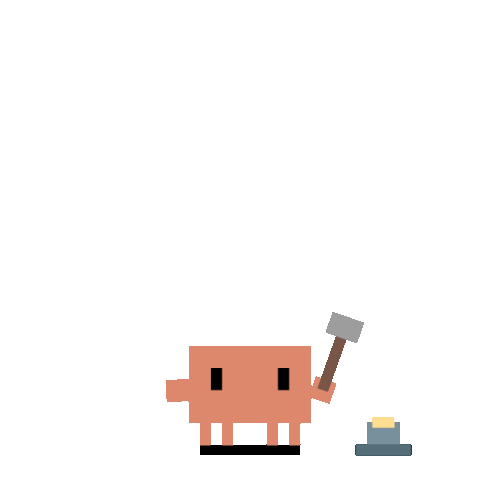

<h2> Hi, I'm Abderrahim </h2>

Software Engineer with 11+ years of experience building production systems across **healthcare**, **publishing**, **government**, and **e-commerce**. I specialize in **AI & Automation**, **Drupal architecture**, and **full-stack development**.

I build autonomous agents, RAG pipelines, Drupal platforms serving 500K+ users, and open-source tools for developers.

### What I work on

**AI & Automation** &mdash; Autonomous agent systems, RAG pipelines, semantic search, LangChain, n8n workflows

**Drupal** &mdash; Custom modules, migration strategies, performance optimization &mdash; deep expertise since 2014

**E-commerce** &mdash; Sylius 2.x plugins (loyalty, upsells, popups, workflow automation)

**Developer Tools** &mdash; Claude Code plugins, CLI tools, MCP servers

### Tech stack

### GitHub stats

<picture>
  <source media="(prefers-color-scheme: dark)" srcset="https://streak-stats.demolab.com?user=abderrahimghazali&theme=github-dark-blue&hide_border=true" />
  <source media="(prefers-color-scheme: light)" srcset="https://streak-stats.demolab.com?user=abderrahimghazali&hide_border=true" />
  
</picture>

---

Open to consulting, contract work, and technical partnerships. You can also [sponsor my work](https://github.com/sponsors/abderrahimghazali).

